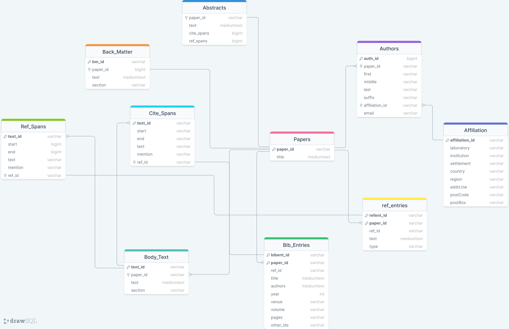

# Convert-Cord-19-Dataset-to-Sqlite-Database

The COVID-19 Open Research Dataset (CORD-19) is a freely available dataset containing over 1,000,000 scholarly articles (including over 400,000 with full text) about COVID-19, SARS-CoV-2, and related coronaviruses. As quoted in the dataset's [paper](https://arxiv.org/pdf/2004.10706) - "CORD-19 is designed to facilitate the development of text mining and information retrieval systems over its rich collection of metadata and structured full-text papers." The dataset can be downloaded directly from [Kaggle](https://www.kaggle.com/datasets/allen-institute-for-ai/CORD-19-research-challenge).

The full-text scholarly articles are stored as JSON files in the CORD-19 dataset. It can often become troublesome to analyze and retrieve information about papers that are stored in JSON format. Thus, this repository contains codes that can used to convert the full-text JSON formatted papers from the Cord-19 dataset into a Sqlite3 database in Python. 

This codebase first extracts the information within the JSON files as a pandas Dataframe, and then these Dataframes are used to create the final Sqlite3 database. The Sqlite3 database distributes the full-text information into separate tables, such as tables for paper abstracts, authors, body text, citations, etc. These tables can be easily queried using the 'paper_id' to obtain specific pieces of information about a paper. A schema of the database is given below-

## Code Description

Firstly, the dataset needs to be [downloaded](https://www.kaggle.com/datasets/allen-institute-for-ai/CORD-19-research-challenge) and extracted in local storage in order to run this code. Inside the downloaded files, the full-text papers are stored in the "document_parses\\pmc_json" and "document_parses\\pdf_json" folders.

- The scripts for extracting pandas Dataframes from the JSON files are placed inside the **"Extract DataFrames from JSON"** folder. Each script extracts different parts of the JSON papers.
- In order to run the scripts, the following variables need to be adjusted:
  - __*source*__ - Set the "source" variable to the location of the "pdf_json" or "pmc_json" folders on your system. The scripts will process all the JSON files present within the source folder.

    **Note:** Most scripts contain two instances of the "source" variable (one inside the *process_file()* method and one towards the end of the script), both of which need to point to the same folder. The exceptions are the "extract_ref_spans.py" and "extract_cite_spans.py" scripts, where the "source" variables are replaced by a single "path" variable within the *main()* method.
    
  - __*chunksize*__ - As the dataset contains hundreds of thousands of JSON files, it is not possible to process all the files at once. Thus, some script files contain the "chunksize" variable to indicate the number of files to be processed at once. It needs to be set based on the available system memory. It is set to 30000 as a default, which works fine for systems with 16GB of RAM.

  - __*start*__ - This variable is present within the "extract_body_texts.py" file. It is used to set the unique "text_id" for each span of text within the "body_text" table. Initially, this variable needs to be set to 0. But, as the script needs to be run twice (once for "pdf_json" folder and another for "pmc_json" folder), during the 2nd run, the "start" variable needs to be set to the number of rows (text_ids) that were extracted from the first folder. However, all the JSON files can be moved to a single folder to simplify this process. In that case, simply set "start" to 0 as a starting point.

  - All the scripts also use the *to_csv()* method to save the dataframes as a csv file. Please ensure that the location for saving the csv file is set correctly.

- The scripts also utilize **multi-processing** to use multiple CPU cores in order to make processing of the JSON files significantly faster. Therefore, most scripts contain the following line of code: ``with concurrent.futures.ProcessPoolExecutor(9) as executor:``. Here, the number inside the parentheses needs to be less than or equal to the number of available cores on the system's CPU.

- After extracting all the Dataframes using the Python scripts, run the **"Create Sqlite Database.ipynb"** notebook to create the Sqlite3 Database from the created csv files.

  **Note:** The csv files should be organized into separate folders (for each SQL table) if the save paths within the *to_csv()* methods were set appropriately in the data extraction scripts.

## Acknowledgement

This code was developed as part of a project funded by the North South University, Dhaka, Bangladesh.
